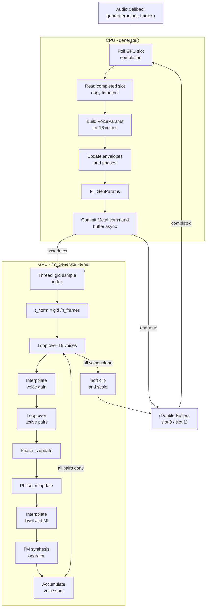
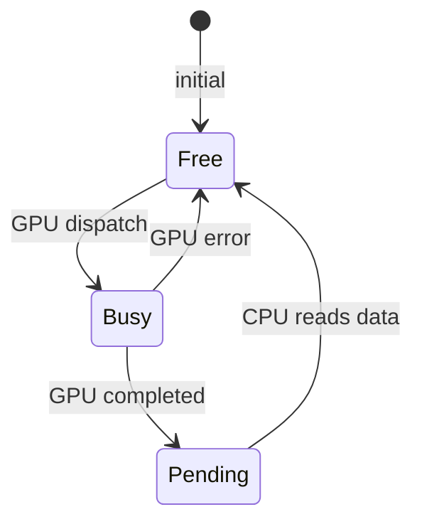
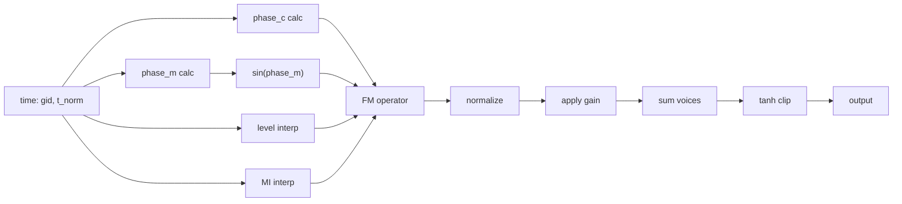
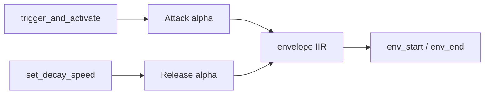

# FMSynth — Operation Documentation

This document explains the design and operation of `FMSynthMetal.mm`, the Metal-backed
FM synthesiser used in **neuronSeqPerform**.  It covers the data model, the CPU-side
`generate()` pipeline, and the GPU kernel `fm_generate`, with pseudocode, Mermaid
diagrams, and the relevant mathematics.

---

## Table of Contents

1. [Overview](#1-overview)
2. [Data Model](#2-data-model)
3. [FM Synthesis Mathematics](#3-fm-synthesis-mathematics)
4. [System Architecture](#4-system-architecture)
5. [The `generate()` Function (CPU side)](#5-the-generate-function-cpu-side)
6. [The `fm_generate` Kernel (GPU side)](#6-the-fm_generate-kernel-gpu-side)
7. [Envelope System](#7-envelope-system)
8. [Phase Accumulation](#8-phase-accumulation)
9. [Output Post-Processing](#9-output-post-processing)
10. [Parameter Reference](#10-parameter-reference)

---

## 1. Overview

`FMSynth` is a polyphonic FM synthesiser with up to **16 simultaneous voices**,
each containing up to **4 carrier/modulator pairs** (8 operators total).  Audio
is generated on the GPU using a Metal compute shader, allowing the CPU audio
callback to return quickly without blocking on synthesis work.

```
Audio callback
     │
     ▼
generate() ──► build VoiceParams (CPU) ──► dispatch fm_generate (GPU, async)
     │
     └──► read previously completed GPU buffer ──► output to audio hardware
```

The pipeline uses **double-buffering**: while one buffer is being read for output,
the GPU is computing the next one.

---

## 2. Data Model

### Constants

| Symbol      | Value | Meaning                               |
|-------------|-------|---------------------------------------|
| `COLS`      | 16    | Maximum voices / sequencer columns    |
| `NUM_OPS`   | 8     | Operators per voice                   |
| `MAX_PAIRS` | 4     | Carrier-modulator pairs per voice     |

### Struct Hierarchy

```
FMSynth::Impl
├── phases[COLS][NUM_OPS]       — current phase (radians) per operator
├── env[NUM_OPS][COLS]          — current envelope amplitude  (0–1)
├── env_target[NUM_OPS][COLS]   — target envelope amplitude   (0–1)
├── voice_gain[COLS]            — per-voice crossfade gain    (0–1)
├── voice_active[COLS]          — which voice is selected
├── ratios[COLS][NUM_OPS]       — frequency ratio per operator
├── levels[COLS][NUM_OPS]       — amplitude level per operator
├── mod_idx[COLS][NUM_OPS]      — modulation index per operator
├── base_freqs[COLS]            — root frequency per voice (Hz)
└── frequencies[COLS][NUM_OPS] — actual Hz = base_freq × ratio × ratio_scale

GPU buffers (double-buffered, index 0/1)
├── outputBuf[2]   — rendered float32 samples (one buffer per slot)
├── voicesBuf[2]   — VoiceParams array (16 voices)
└── genParBuf[2]   — GenParams (shared scalars)
```

### GPU Structs

```c
struct PairParams {          // one carrier + one modulator
    float freq_c, freq_m;        // frequencies (Hz)
    float level_start, level_end; // carrier amplitude at start/end of buffer
    float mi_start, mi_end;       // modulation index at start/end
    float phase_c, phase_m;       // initial phases (radians)
};  // 32 bytes

struct VoiceParams {         // one sequencer column
    PairParams pairs[4];     // up to 4 pairs
    float  gain_start, gain_end;  // voice crossfade gain
    uint   n_pairs;              // active pairs (0 = skip voice)
    float  _pad;
};  // 144 bytes

struct GenParams {           // shared scalar parameters
    float inv_sr;            // 1 / sample_rate
    float master_volume;
    uint  n_frames;
    uint  _pad;
};  // 16 bytes
```

---

## 3. FM Synthesis Mathematics

### Basic FM

Classical frequency modulation synthesis:

$$y(t) = A \cdot \sin\!\Bigl(\phi_c(t) + I \cdot \sin\!\bigl(\phi_m(t)\bigr)\Bigr)$$

where:
- $A$ — carrier amplitude (level)
- $\phi_c(t) = \phi_{c,0} + 2\pi f_c \cdot t$ — carrier phase at time $t$
- $\phi_m(t) = \phi_{m,0} + 2\pi f_m \cdot t$ — modulator phase at time $t$
- $I$ — modulation index (controls spectral richness)
- $f_c, f_m$ — carrier and modulator frequencies (Hz)

### Operator Frequency

$$f_{\text{op}} = f_{\text{base}} \times r_{\text{op}} \times r_{\text{scale}}$$

where $r_{\text{op}}$ is the preset ratio and $r_{\text{scale}}$ is a global tuning scale.

### Modulation Index Scaling

$$I_{\text{effective}} = \texttt{mod\_idx}[\text{col}][\text{op}] \times \texttt{mod\_index\_scale} \times e_m$$

where $e_m$ is the modulator envelope value (0–1).

### Voice Sum and Limiting

All active voices are accumulated, normalised per voice by pair count, then passed
through a soft-clip:

$$\text{output}[n] = \tanh\!\Bigl(0.7 \sum_{v} \frac{\text{voice}_v[n] \cdot G_v}{P_v}\Bigr) \times V_{\text{master}}$$

where $G_v$ is the voice gain and $P_v$ is the number of active pairs.

---

## 4. System Architecture



---

## 5. The `generate()` Function (CPU side)

`generate()` is called from the real-time audio callback once per buffer (~1024 samples).

### Pseudocode

```
function generate(output[], frames):

    # ── Phase 1: Poll GPU completion ─────────────────────────────────────────
    for slot in {0, 1}:
        if slotBusy[slot]:
            status = inFlightCmd[slot].status
            if status == Completed:
                slotBusy[slot] = false
            elif status == Error:
                slotBusy[slot] = false
                slotHadError[slot] = true

    # ── Phase 2: Consume oldest finished slot ─────────────────────────────────
    produced = false
    if pendingCount > 0:
        readSlot = pendingSlots[0]       # FIFO – oldest first
        if not slotBusy[readSlot]:
            if not slotHadError[readSlot] and inFlightFrames[readSlot] > 0:
                memcpy(output, outputBuf[readSlot], frames * 4)
                produced = true
            pop_pending_front()

    # ── Phase 3: Submit next render to GPU ────────────────────────────────────
    submitSlot = first free, non-pending slot (or -1 if both busy)

    if submitSlot >= 0:

        # 3a. Build VoiceParams (one per column)
        for col in 0..15:
            # Smooth voice gain (prevents zipper noise when switching voices)
            target = 1.0 if voice_active[col] else 0.0
            voice_gain[col] += (target - voice_gain[col]) * 0.2

            vp.gain_start = old_gain
            vp.gain_end   = new_gain
            vp.n_pairs    = active_pairs  (0 if gain is zero)

            for pair in 0..active_pairs-1:
                c_op = pair * 2         # carrier operator index
                m_op = pair * 2 + 1     # modulator operator index

                # Envelope smoothing (attack is slow, release follows per_buf decay)
                ec_alpha = env_attack_carrier  if target_c > env_c  else env_release_carrier
                em_alpha = env_attack_mod      if target_m > env_m  else env_release_mod
                ec_new = ec_old + (target_c - ec_old) * ec_alpha
                em_new = em_old + (target_m - em_old) * em_alpha

                pp.freq_c       = frequencies[col][c_op]
                pp.freq_m       = frequencies[col][m_op]
                pp.level_start  = levels[col][c_op] * ec_old
                pp.level_end    = levels[col][c_op] * ec_new
                pp.mi_start     = mod_idx[col][m_op] * mod_index_scale * em_old
                pp.mi_end       = mod_idx[col][m_op] * mod_index_scale * em_new
                pp.phase_c      = phases[col][c_op]
                pp.phase_m      = phases[col][m_op]

                env[c_op][col] = ec_new
                env[m_op][col] = em_new

                # Advance phase state for next buffer
                phases[col][c_op] = (phases[col][c_op] + 2*pi * freq_c / sr * frames) mod 2*pi
                phases[col][m_op] = (phases[col][m_op] + 2*pi * freq_m / sr * frames) mod 2*pi

        # 3b. Fill GenParams
        gp.inv_sr        = 1 / sample_rate
        gp.master_volume = master_volume
        gp.n_frames      = frames

        # 3c. Encode and commit Metal command buffer (non-blocking)
        encoder.setBuffers(outputBuf, voicesBuf, genParBuf)
        encoder.dispatchThreads(n=frames, threadsPerGroup=min(maxTG, frames))
        cmdbuf.commit()                  # GPU starts asynchronously

        mark submitSlot as busy, add to pendingSlots queue

    # ── Phase 4: Fallback if no data produced ────────────────────────────────
    if not produced:
        if last_good_output is available:
            memcpy(output, last_good_output, frames * 4)
        else:
            memset(output, 0, frames * 4)
        return

    # ── Phase 5: De-click at block boundaries ─────────────────────────────────
    for i in 0..declick_samples-1:
        t = i / (declick_samples - 1)
        output[i] = prev_last_sample + (output[i] - prev_last_sample) * t

    last_output_sample = output[frames - 1]
    save output as last_good_output
```

### Double-Buffer State Machine



---

## 6. The `fm_generate` Kernel (GPU side)

Each GPU thread handles **one output sample** at grid index `gid`.

### Pseudocode

```
kernel fm_generate(output[], voices[], gp):
    gid = thread_position_in_grid
    if gid >= gp.n_frames: return

    t      = float(gid)                          # sample index
    t_norm = t / n_frames                        # 0.0 to 1.0 across buffer

    sample = 0.0

    for v in 0..15:
        vp = voices[v]
        if vp.n_pairs == 0: continue

        gain  = mix(vp.gain_start, vp.gain_end, t_norm)
        if gain <= 0: continue

        voice = 0.0
        for p in 0..vp.n_pairs-1:
            pp = vp.pairs[p]

            # Phase at this sample (linear accumulation from buffer start)
            phase_c = pp.phase_c + 2*pi * pp.freq_c * gp.inv_sr * t
            phase_m = pp.phase_m + 2*pi * pp.freq_m * gp.inv_sr * t

            # Per-sample linear interpolation of envelope and MI
            level = mix(pp.level_start, pp.level_end, t_norm)
            mi    = mix(pp.mi_start,    pp.mi_end,    t_norm)

            # FM formula
            mod    = sin(phase_m)  if pp.freq_m > 0  else 0.0
            voice += level * sin(phase_c + mi * mod)

        voice /= float(vp.n_pairs)      # normalise by pair count
        sample += voice * gain

    # Soft clip + master volume
    output[gid] = tanh(sample * 0.7) * gp.master_volume
```

### Signal Flow for a Single Sample



---

## 7. Envelope System

Each operator has an independent first-order IIR (one-pole) envelope follower:

$$e[n+1] = e[n] + \alpha \cdot (e_{\text{target}} - e[n])$$

where $\alpha$ switches between two rates:

| Condition | α Value | Behaviour |
|-----------|---------|-----------|
| Attack (target > e) | env_attack_carrier/mod (approx 0.08) | ~280 ms rise |
| Release (target ≤ e) | 1 - per_buf_carrier/mod | set by set_decay_speed() |

The two envelope values (`env_start`, `env_end`) are passed to the GPU and linearly
interpolated per-sample, so the amplitude ramp is smooth across the whole buffer.



`set_decay_speed(speed)` maps `speed` in [0, 1] to per-buffer decay multipliers:

- per_buf_carrier = 0.9953 - speed * (0.9953 - 0.862)
- per_buf_mod = 0.9900 - speed * (0.9900 - 0.750)

At speed=0 (sustain) decay is very slow; at speed=1 (staccato) it is fast.

---

## 8. Phase Accumulation

Phases are maintained on the CPU and passed to the GPU as initial conditions for each
buffer. The GPU computes phase linearly from the starting value:

$$\phi[n] = \phi_0 + 2\pi \cdot f \cdot \frac{n}{f_s}$$

At the end of each buffer the CPU advances the stored phase:

$$\phi_0 \leftarrow \left(\phi_0 + 2\pi \cdot f \cdot \frac{N}{f_s}\right) \bmod 2\pi$$

where $N$ is the buffer length and $f_s$ is the sample rate. This ensures phase
continuity across buffer boundaries without the GPU needing to write back.

---

## 9. Output Post-Processing

### Soft Clipping

After summing all voices the GPU applies a hyperbolic-tangent soft clipper:

$$y = \tanh(0.7 \cdot x) \cdot V_{\text{master}}$$

The factor $0.7$ sets the headroom before the non-linear region. $\tanh$ limits
the output to $(-1, +1)$ while introducing harmonic saturation rather than hard
clipping distortion.

### De-click Crossfade (CPU)

To suppress discontinuities at audio block boundaries, the CPU applies a linear
crossfade over the first `output_declick_samples` (default 24) samples:

$$\text{out}[i] = y_{\text{prev}} + \bigl(\text{out}[i] - y_{\text{prev}}\bigr) \cdot \frac{i}{N_{\text{declick}} - 1}$$

where $y_{\text{prev}}$ is the last sample of the previous block.

---

## 10. Parameter Reference

| Method / Field | Default | Effect |
|---|---|---|
| `set_master_volume(v)` | 0.5 | Output gain after tanh |
| `set_mod_index_scale(s)` | 0.25 | Global MI multiplier |
| `set_active_pairs(n)` | 2 | Number of carrier/mod pairs (1–4) |
| `set_decay_speed(s)` | — | 0 = sustain, 1 = staccato |
| `set_ratio_scale(r)` | 1.0 | Transposes all operator frequencies |
| `set_base_freq(col, f)` | C4 | Root frequency for one voice |
| `load_preset(col, ...)` | — | Set ratios, levels, mod-indices |
| `trigger_and_activate(...)` | — | Gate voice and set envelope targets |
| `env_attack_carrier/mod` | 0.08 | Attack smoothing coefficient (~280ms) |
| `output_declick_samples` | 24 | Crossfade length at block boundaries |
